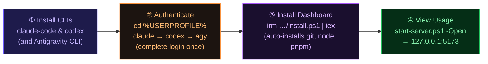

<div align="center">
  <br />
  
  <br /><br />

  <h1>AI Usage Dashboard</h1>
  <p>Monitor <strong>Claude</strong>, <strong>Codex</strong>, and <strong>Antigravity CLI</strong> usage in one local dashboard.<br />No cloud. No telemetry. Runs entirely on your machine.</p>

  <br />

  <a href="https://savvy773.github.io/ai_usage/">
    
  </a>
  &nbsp;
  <a href="https://github.com/savvy773/ai_usage/releases">
    
  </a>
  &nbsp;
  <a href="https://github.com/savvy773/ai_usage/wiki">
    
  </a>

<br /><br />

  
  
  
  
  
  

<br /><br />

  <p>
    <a href="#-install">Install</a> ·
    <a href="#-features">Features</a> ·
    <a href="#-cli-targets">CLI Targets</a> ·
    <a href="#-development">Development</a> ·
    <a href="docs/architecture.md">Architecture</a> ·
    <a href="docs/fix_check.md">Fix Checklist</a>
  </p>
  <br />
</div>

---

A **SvelteKit server** collects each CLI, captures the output, parses usage data, and stores results locally. Each CLI runs in a hidden persistent `node-pty` session that is spawned once on the first refresh and reused afterwards, so scheduled refreshes do not repeatedly open terminal windows. Auto collection runs on the server even while the dashboard is hidden; the browser updates its display only while the dashboard tab is visible. No API keys, no accounts, no data leaving your machine.

<br />

## 🗺 Setup Flow



<br />

## ✨ Features

|     | Feature              | Description                                                                                 |
| :-: | :------------------- | :------------------------------------------------------------------------------------------ |
| ⚡  | **Multi-provider**   | Runs Claude `/usage` · Codex `/status` · Antigravity `/usage`                               |
| ⏱️  | **Auto interval**    | Silent server collection every 1, 3, 5, or 10 minutes; 3 minutes is the default             |
|  ↻  | **Smart retry**      | Up to 5 attempts with phase diagnostics and repeated slash-command confirmation             |
| 📊  | **Weekly Pace card** | Usage bar vs. 20 % minimum threshold — see if you're on track                               |
|  ⏱  | **Reset countdown**  | Live per-provider countdown to next usage reset                                             |
| 📡  | **Live server logs** | SSE stream rendered directly in the browser — no polling                                    |
| 💾  | **Dual cache**       | Server-side JSON history (10-min buckets) + `localStorage` fallback for instant first paint |

<br />

## 📦 Install

### Step 1 — Install the AI CLIs

The dashboard collects data by running each CLI in a virtual terminal. **Install whichever CLIs you want to monitor:**

```powershell
irm https://claude.ai/install.ps1 | iex    # Claude
npm install -g @openai/codex               # Codex
irm https://antigravity.google/cli/install.ps1 | iex  # Antigravity
```

### Step 2 — Pre-authenticate each CLI

> **This step is required.** Manual and scheduled auto refresh launch CLIs silently and send a slash command — any first-run wizard, login prompt, or trust dialog will cause a timeout and no data will be collected.

Run each CLI **once** in the directory you plan to use as your working directory, complete the full auth flow, then exit:

```powershell
cd %USERPROFILE%

claude               # → OAuth → /exit
codex                # → setup → exit
agy                  # → setup → exit
```

> If you want CLIs to run in a different directory, set `AI_USAGE_CWD` in `.env` — but you must authenticate there too. See [Custom CLI working directory](#) below.

### Step 3 — Install the Dashboard

**One-liner** — checks prerequisites, auto-installs git/Node.js/pnpm if missing:

```powershell
# Interactive (prompts for confirmation)
irm https://raw.githubusercontent.com/savvy773/ai_usage/main/scripts/install.ps1 | iex

# Unattended — skip all prompts, open browser on finish
& ([scriptblock]::Create((irm 'https://raw.githubusercontent.com/savvy773/ai_usage/main/scripts/install.ps1'))) -Yes -Open
```

**Or clone manually:**

```powershell
git clone https://github.com/savvy773/ai_usage.git
cd ai_usage
pnpm install
.\scripts\start-server.ps1 -Open
```

<details>
<summary>System requirements</summary>

| Requirement                         | Why                                                      |
| :---------------------------------- | :------------------------------------------------------- |
| Windows                             | `node-pty` and the server launcher are Windows-only      |
| Node.js 20+                         | Runtime — auto-installed by one-liner if missing         |
| pnpm                                | Package manager — auto-installed by one-liner if missing |
| **Visual Studio Build Tools (C++)** | `node-pty` compiles native code during `pnpm install`    |
| Python 3                            | Used by `node-gyp` during native compilation             |

</details>

<details>
<summary>Build Tools missing? — fix for fresh PCs</summary>

```powershell
winget install Microsoft.VisualStudio.2022.BuildTools `
  --override "--add Microsoft.VisualStudio.Workload.VCTools --includeRecommended --passive"
```

Then re-run `pnpm install`.

</details>

<details>
<summary>start-server.ps1 options</summary>

```powershell
.\scripts\start-server.ps1 -Open          # open browser on start
.\scripts\start-server.ps1 -Port 5174     # custom port (default 5173)
.\scripts\start-server.ps1 -Mode dev      # hot-reload dev mode
.\scripts\start-server.ps1 -Mode preview  # production preview (default)
.\scripts\start-server.ps1 -NoRestart     # skip server restart
.\scripts\start-server.ps1 -Status        # show running server info
.\scripts\start-server.ps1 -Help          # all options
```

> Uses `--strictPort`. Only stops a server it previously started — never kills unrelated processes on the same port.

</details>

<details>
<summary>Custom CLI working directory</summary>

The normal setup is two shared candidates in `.env`:

```text
AI_USAGE_CWD=D:\Code\_temp
AI_USAGE_CWD_CANDIDATES=%TEMP%
```

When `AI_USAGE_CWD` or `AI_USAGE_CWD_CANDIDATES` is set, the collector uses only those shared candidates, up to three paths total:

1. `AI_USAGE_CWD`
2. `AI_USAGE_CWD_CANDIDATES`, split by semicolon

If both are unset, the built-in fallback order is:

1. `..\..\_temp` when installed under `_toolkit\aI_usage`
2. `%TEMP%`
3. `%TMP%`

To change the preferred path or add fallbacks for multiple PCs, edit `.env`:

```text
AI_USAGE_CWD=..\..\_temp
AI_USAGE_CWD_CANDIDATES=%TEMP%
```

Relative paths such as `..\..\_temp` are resolved from the dashboard project root, so the same config works across PCs after `irm` installation. Keep this directory outside the Git repo to avoid repo-root trust prompts. `%TEMP%`, `%TMP%`, `$env:TEMP`, and `$env:TMP` are expanded at runtime. The collector creates the working directory if it is missing, but it does not intentionally create persistent files inside it; if a CLI creates temporary files, it owns their cleanup. Each CLI uses at most three candidates. Shared settings are enough for normal use. To customize an unusual provider-specific setup, set `AI_USAGE_CWD_CLAUDE`, `AI_USAGE_CWD_CODEX`, `AI_USAGE_CWD_GEMINI` (used by Antigravity), or their `AI_USAGE_CWD_CANDIDATES_*` variants. Each CLI must be pre-authenticated/trusted in at least one candidate directory. Parsed raw snapshots include the selected `workingDirectory` and all `workingDirectoryCandidates`. Claude retries incomplete `/usage` loading in the same working directory; it only advances to the next candidate when a trust prompt blocks collection.

Claude `/usage` requests are rate-limited to one request every 50 seconds, including retries and closely spaced manual/automatic refreshes. Claude can first paint cached percentages while the panel still says `Refreshing...`; the collector waits for terminal output to settle, forces one final full repaint, and only then stores the parsed values.

Codex stores trusted directories per user in `%USERPROFILE%\.codex\config.toml` under `[projects.'path']` entries with `trust_level = "trusted"`.

</details>

<br />

## 🔄 Auto Refresh

Auto refresh defaults to **3 minutes**. Use the interval control in the dashboard to choose **1, 3, 5, or 10 minutes**.

When Auto is on, the server collects in the background on the selected interval. A visible dashboard rechecks the cached result every 10 seconds and renders it even when another app has keyboard focus. Minimizing the browser or switching tabs pauses browser-side display polling, but silent server collection continues. Returning to the dashboard immediately loads the newest stored result. Manual **Refresh** remains available on demand.

<br />

## 🖥 CLI Targets

| Provider        | Command  | Slash     | Shows                          |
| :-------------- | :------- | :-------- | :----------------------------- |
| Claude          | `claude` | `/usage`  | current session + weekly usage |
| Codex           | `codex`  | `/status` | 5h limit + weekly limit        |
| Antigravity CLI | `agy`    | `/usage`  | per-model usage + resets       |

> Antigravity `/usage` works with plain `agy`; no dashboard-specific skip-permissions flag is required.

<br />

## 🔧 Development

```powershell
pnpm dev        # hot-reload dev server
pnpm check      # TypeScript + Svelte type check
pnpm build      # production build
pnpm lint       # ESLint + Prettier
```

Verbose collector output:

```powershell
$env:AI_USAGE_DEBUG_LOGS=1; .\scripts\start-server.ps1
```

<br />

## 📂 Data Files

All runtime files are git-ignored.

| Path                                   | Description                                 |
| :------------------------------------- | :------------------------------------------ |
| `data/usage-history.json`              | Full history — 10-min buckets, last 12 kept |
| `data/usage-latest.json`               | Latest payload served by `/api/usage`       |
| `data/raw/{provider}-latest.txt`       | Last raw CLI terminal output                |
| `data/raw/{provider}-last-failure.txt` | Last failed capture                         |
| `data/logs/collector.log`              | Collector diagnostics                       |
| `data/logs/server.log`                 | Server log                                  |

Codex `codex-loading` captures with no usage markers are treated as startup misses while retries continue. If Codex asks for a `/status` refresh, the collector clears the prompt before resending `/status` in the same session. These captures are still visible in `{provider}-latest.*`, but they do not produce normal recovery noise unless the final attempt fails.

<br />

## 🛠 Tech Stack

<p>
  <a href="https://kit.svelte.dev/"></a>
  <a href="https://tailwindcss.com/"></a>
  <a href="https://www.typescriptlang.org/"></a>
  <a href="https://www.shadcn-svelte.com/"></a>
  <a href="https://github.com/microsoft/node-pty"></a>
  <a href="https://vitejs.dev/"></a>
</p>

<br />

## 📖 Docs

|                                                   |                                                                |
| :------------------------------------------------ | :------------------------------------------------------------- |
| [Architecture](docs/architecture.md)              | Implementation structure, API contract, refresh and cache flow |
| [Fix Checklist](docs/fix_check.md)                | Step-by-step diagnostics for collection and parser errors      |
| [Wiki](https://github.com/savvy773/ai_usage/wiki) | Quick Start, API Reference, and more                           |

<br />

---

<div align="center">
  <sub>© 2026 savvy773 · MIT License · Local. Private. Yours.</sub>
</div>
