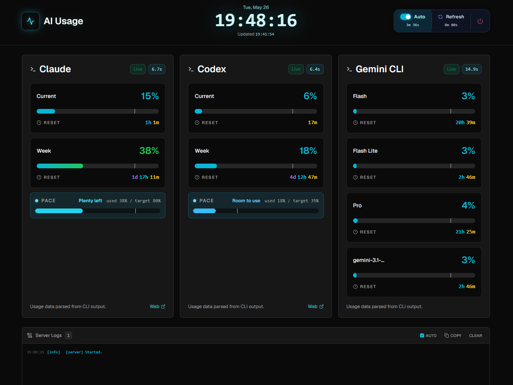
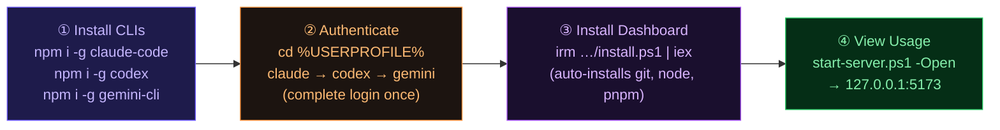

<div align="center">
  <br />
  
  <br /><br />

  <h1>AI Usage Dashboard</h1>
  <p>Monitor <strong>Claude</strong>, <strong>Codex</strong>, and <strong>Gemini CLI</strong> usage in one local dashboard.<br />No cloud. No telemetry. Runs entirely on your machine.</p>

  <br />

  <a href="https://savvy773.github.io/ai_usage/">
    
  </a>
  &nbsp;
  <a href="https://github.com/savvy773/ai_usage/releases">
    
  </a>
  &nbsp;
  <a href="https://github.com/savvy773/ai_usage/wiki">
    
  </a>

<br /><br />

  
  
  
  
  
  

<br /><br />

  <p>
    <a href="#-install">Install</a> ·
    <a href="#-features">Features</a> ·
    <a href="#-cli-targets">CLI Targets</a> ·
    <a href="#-development">Development</a> ·
    <a href="docs/architecture.md">Architecture</a> ·
    <a href="docs/fix_check.md">Fix Checklist</a>
  </p>
  <br />
</div>

---

A **SvelteKit server** spawns each CLI in a virtual terminal via **node-pty**, captures the output, parses usage data, and stores results locally. The browser renders from cached JSON on first paint — no API keys, no accounts, no data leaving your machine.

<br />

## 🗺 Setup Flow



<br />

## ✨ Features

|     | Feature              | Description                                                                                 |
| :-: | :------------------- | :------------------------------------------------------------------------------------------ |
| ⚡  | **Multi-provider**   | Runs Claude `/usage` · Codex `/status` · Gemini `/model` in virtual terminals               |
|  ↻  | **Smart retry**      | Up to 5 attempts with phase diagnostics and repeated slash-command confirmation             |
| 📊  | **Weekly Pace card** | Usage bar vs. 20 % minimum threshold — see if you're on track                               |
|  ⏱  | **Reset countdown**  | Live per-provider countdown to next usage reset                                             |
| 📡  | **Live server logs** | SSE stream rendered directly in the browser — no polling                                    |
| 💾  | **Dual cache**       | Server-side JSON history (10-min buckets) + `localStorage` fallback for instant first paint |

<br />

## 📦 Install

### Step 1 — Install the AI CLIs

The dashboard collects data by running each CLI in a virtual terminal. **Install whichever CLIs you want to monitor:**

```powershell
npm install -g @anthropic-ai/claude-code   # Claude
npm install -g @openai/codex               # Codex
npm install -g @google/gemini-cli          # Gemini CLI
```

### Step 2 — Pre-authenticate each CLI

> **This step is required.** The collector launches CLIs silently and sends a slash command — any first-run wizard, login prompt, or trust dialog will cause a timeout and no data will be collected.

Run each CLI **once** in the directory you plan to use as your working directory, complete the full auth flow, then exit:

```powershell
# Default working directory is %USERPROFILE%
cd $env:USERPROFILE

claude               # → complete browser OAuth → type /exit
codex                # → complete setup wizard → exit
gemini --skip-trust  # → complete Google auth  → exit
```

> If you want CLIs to run in a different directory, set `AI_USAGE_CWD` in `.env` — but you must authenticate there too. See [Custom CLI working directory](#) below.

### Step 3 — Install the Dashboard

**One-liner** — checks prerequisites, auto-installs git/Node.js/pnpm if missing:

```powershell
# Interactive (prompts for confirmation)
irm https://raw.githubusercontent.com/savvy773/ai_usage/main/scripts/install.ps1 | iex

# Unattended — skip all prompts, open browser on finish
& ([scriptblock]::Create((irm 'https://raw.githubusercontent.com/savvy773/ai_usage/main/scripts/install.ps1'))) -Yes -Open
```

**Or clone manually:**

```powershell
git clone https://github.com/savvy773/ai_usage.git
cd ai_usage
pnpm install
.\scripts\start-server.ps1 -Open
```

<details>
<summary>System requirements</summary>

| Requirement                         | Why                                                      |
| :---------------------------------- | :------------------------------------------------------- |
| Windows                             | `node-pty` and the server launcher are Windows-only      |
| Node.js 20+                         | Runtime — auto-installed by one-liner if missing         |
| pnpm                                | Package manager — auto-installed by one-liner if missing |
| **Visual Studio Build Tools (C++)** | `node-pty` compiles native code during `pnpm install`    |
| Python 3                            | Used by `node-gyp` during native compilation             |

</details>

<details>
<summary>Build Tools missing? — fix for fresh PCs</summary>

```powershell
winget install Microsoft.VisualStudio.2022.BuildTools `
  --override "--add Microsoft.VisualStudio.Workload.VCTools --includeRecommended --passive"
```

Then re-run `pnpm install`.

</details>

<details>
<summary>start-server.ps1 options</summary>

```powershell
.\scripts\start-server.ps1 -Open          # open browser on start
.\scripts\start-server.ps1 -Port 5174     # custom port (default 5173)
.\scripts\start-server.ps1 -Mode dev      # hot-reload dev mode
.\scripts\start-server.ps1 -Mode preview  # production preview (default)
.\scripts\start-server.ps1 -NoRestart     # skip server restart
.\scripts\start-server.ps1 -Status        # show running server info
.\scripts\start-server.ps1 -Help          # all options
```

> Uses `--strictPort`. Only stops a server it previously started — never kills unrelated processes on the same port.

</details>

<details>
<summary>Custom CLI working directory</summary>

The collector tries CLI working directories in this order:

1. `AI_USAGE_CWD`
2. `AI_USAGE_CWD_CANDIDATES`, split by semicolon
3. `%USERPROFILE%`
4. the dashboard install path

To change the preferred path or add fallbacks, copy `.env.example` → `.env` and set:

```text
AI_USAGE_CWD=D:\your\path
AI_USAGE_CWD_CANDIDATES=D:\Code\_temp;C:\Users\yourname;D:\Code\_toolkit\aI_usage
```

Each CLI must be pre-authenticated/trusted in at least one candidate directory. Parsed raw snapshots include the selected `workingDirectory` and all `workingDirectoryCandidates`.

</details>

<br />

## 🖥 CLI Targets

| Provider   | Command               | Slash     | Shows                          |
| :--------- | :-------------------- | :-------- | :----------------------------- |
| Claude     | `claude`              | `/usage`  | current session + weekly usage |
| Codex      | `codex`               | `/status` | 5h limit + weekly limit        |
| Gemini CLI | `gemini --skip-trust` | `/model`  | per-model usage + resets       |

> `--skip-trust` bypasses Gemini's workspace prompt. Claude and Codex don't use equivalent flags — they affect auth policy and break collection.

<br />

## 🔧 Development

```powershell
pnpm dev        # hot-reload dev server
pnpm check      # TypeScript + Svelte type check
pnpm build      # production build
pnpm lint       # ESLint + Prettier
```

Verbose collector output:

```powershell
$env:AI_USAGE_DEBUG_LOGS=1; .\scripts\start-server.ps1
```

<br />

## 📂 Data Files

All runtime files are git-ignored.

| Path                                   | Description                                 |
| :------------------------------------- | :------------------------------------------ |
| `data/usage-history.json`              | Full history — 10-min buckets, last 12 kept |
| `data/usage-latest.json`               | Latest payload served by `/api/usage`       |
| `data/raw/{provider}-latest.txt`       | Last raw CLI terminal output                |
| `data/raw/{provider}-last-failure.txt` | Last failed capture                         |
| `data/logs/collector.log`              | Collector diagnostics                       |
| `data/logs/server.log`                 | Server log                                  |

Codex `codex-loading` captures with no usage markers are treated as startup misses while retries continue. They are still visible in `{provider}-latest.*`, but they do not produce normal recovery noise unless the final attempt fails.

<br />

## 🛠 Tech Stack

<p>
  <a href="https://kit.svelte.dev/"></a>
  <a href="https://tailwindcss.com/"></a>
  <a href="https://www.typescriptlang.org/"></a>
  <a href="https://www.shadcn-svelte.com/"></a>
  <a href="https://github.com/microsoft/node-pty"></a>
  <a href="https://vitejs.dev/"></a>
</p>

<br />

## 📖 Docs

|                                                   |                                                                |
| :------------------------------------------------ | :------------------------------------------------------------- |
| [Architecture](docs/architecture.md)              | Implementation structure, API contract, refresh and cache flow |
| [Fix Checklist](docs/fix_check.md)                | Step-by-step diagnostics for collection and parser errors      |
| [Wiki](https://github.com/savvy773/ai_usage/wiki) | Quick Start, API Reference, and more                           |

<br />

---

<div align="center">
  <sub>MIT License · Local. Private. Yours.</sub>
</div>
